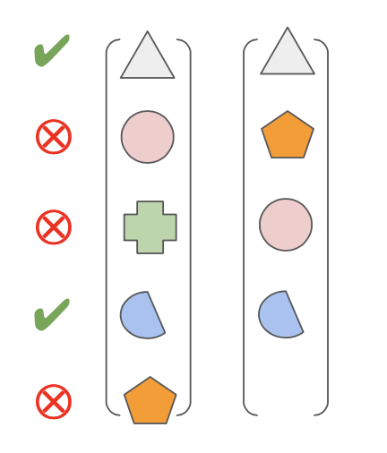
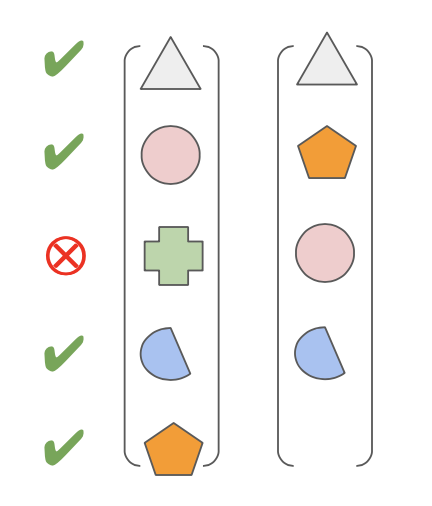

[](https://github.com/semantic-release/semantic-release)
[](https://github.com/airbnb/javascript)
[](https://conventionalcommits.org)

[](https://dashboard.cypress.io/projects/cvb1my/runs)
[](https://codeclimate.com/github/diegopamio/json-similarity-score/maintainability)
[](https://codeclimate.com/github/diegopamio/json-similarity-score/test_coverage)

# JSON-Compare

This open source app is continuously being deployed on every master commit to:
* https://json-compare.online
* https://json-compare.com
* https://json-compare.info
* https://json-comparison.online
* https://json-comparison.com
* https://json-comparison.info
* https://json-similarity-score.vercel.app

You can freely use it there, download and use it by yourself, or make a pull request to improve the app and its correposnding live server(s).
 
# Design decisions and overall aproaches

_Note: these are all subject to consideration if you find anything better._ 

## Some tech stack decisions 

* Used `npm`, though would be ok to use `yarn`, just because I'm used to and the things that were awful to me of `npm` in comparison with `yarn` have been resolved.
  
*  Used `material-ui` for stying as the project doesn't require any special styling so any decent UI styling library would suffice.
  
*  In other circumstances, I'd rather use either `emotionjs` or `styled-components`, but with the css-in-js solution from `material-ui` I'm so far comfortable.

## Code Quality tools:

* `semantic-release` to automatically generate releases in GitHub, CHANGELOGs and bump `package.json` and related files versions.
* `commitlint`
* `eslint`
* `husky` (to automate `lint-staged` and `commit-lint` in each commit

* Code climate, to assess duplication and low-level good practices.
* Testing: Jest for unit tests, as the logic on the comparison function could be quite complex, and to do TDD, and cypress as an e2e test where the acceptance examples are automatically checked to as an acceptance criteria.

# About the algorithm

At first, one would think comparing JSONs is quite trivial, moreover in JavaScript, but there are some quirks that needed either to use common sense or to provide with some configuration options to the end users.

These are the ones I've discovered so far:

## Comparing arrays

Arrays are naturally unsorted, so in order to compare them, you can choose to:

1. Compare one by one enforcing the need for them to have the same index in order to be considered equal.

2. Making a permutation of each possible position and matching between the elements of each one of the arrays and keeping the best one as the overall score.


Option 1 is faster, option 2 is more aligned with the spirit of arrays. In the app, there is an option setting to decide which one to use.

## How to "weight in" the different levels

If two JSONs has only two keys, and one of them is in both JSON a single number, let's say `3`, but in the other key, they both have a four-level nested json with thousands of arrays, sub-objects, sub-arrays and text and numbers, for which they are only completely different, would you say they are 50% equal (1 out of 2 keys) or almost completely different? 

Options are:
* All the nodes weight the same, so a root node with several nested nodes would weight more than the other siblings.
* Each node at a given level have a weight in the total equal to 1 / the number of sibblings. And its sub-tree nodes add to that fraction only.
 
_(Pictue and option setting for this one comming in future releases)_

## How to count missing branches

If some element is missing in one of the JSON but present in the other, you could choose to count that as:

* 1 in one side, and 0 in the other.
* number of root nodes in one side, and 0 in the other.
* number of all the nested nodes in one side, and 0 in the other.

_(Pictue and option setting for this one comming in future releases)_

# What it DOESN'T has
- i18n
- Three or n-way comparison
- Things that are in the roadmap

## Roadmap

* Integration with third-party tools:
  * [ ] Sentry (for error logging).
  * [ ] Heap (for analytics).
  * [ ] FullStory (to analyze user’s behavior).
  * [ ] Crisp (as the only support I’ll offer to end users).
* Algorithm options:
  * [ ] Weighed by level vs weighed by sub-tree size scoring
  * [x] ~~Order-Forced vs Any-to-any array subtree comparison~~
  * [ ] Counting 0/1 or 0/<subtree size> when some ket is present in only one of the sides
* UI/Features:
  * [ ] Able to edit JSON files inline in the app.
  * [ ] Able to have different comparisons at once with “tabs”.
  * [ ] Save comparison analysis
  * [ ] Algorithm options guidance and explanation.
  * [ ] Example comparisons.
* Other:
  * [x] ~~Do a proper README.md beyond the badges galore.~~
  * [ ] Make it a PWA.
  * [ ] Attain 100% code coverage.
* more things to come...


# Running on your own

This is a [Next.js](https://nextjs.org/) project bootstrapped with [`create-next-app`](https://github.com/vercel/next.js/tree/canary/packages/create-next-app).

## Getting Started

First, run the development server:

```bash
npm run dev
# or
yarn dev
```

Open [http://localhost:3000](http://localhost:3000) with your browser to see the result.

You can start editing the page by modifying `pages/index.js`. The page auto-updates as you edit the file.

## Learn More

To learn more about Next.js, take a look at the following resources:

- [Next.js Documentation](https://nextjs.org/docs) - learn about Next.js features and API.
- [Learn Next.js](https://nextjs.org/learn) - an interactive Next.js tutorial.

You can check out [the Next.js GitHub repository](https://github.com/vercel/next.js/) - your feedback and contributions are welcome!

## Deploy on Vercel

The easiest way to deploy your Next.js app is to use the [Vercel Platform](https://vercel.com/import?utm_medium=default-template&filter=next.js&utm_source=create-next-app&utm_campaign=create-next-app-readme) from the creators of Next.js.

Check out our [Next.js deployment documentation](https://nextjs.org/docs/deployment) for more details.
